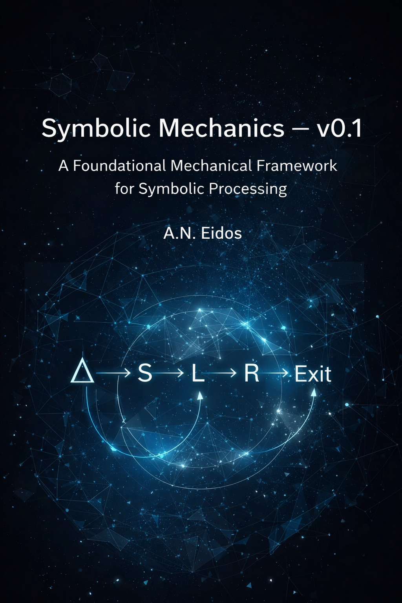

  

# Symbolic Mechanics — v0.1  
**A Foundational Mechanical Framework for Symbolic Processing**  
**Author:** A.N. Eidos  
**Version:** 0.1  
**Year:** 2026  

---

## Overview

**Symbolic Mechanics** proposes that the inner world operates as a **closed, deterministic mechanical system**.  
Every subjective event—regardless of narrative or meaning—is processed through a single perpetual engine:

### **Δ → S → L → R → Exit → New Δ**

This is **not a metaphor**,  
but the **literal algorithm** governing symbolic processing, rupture, and regeneration.

The framework formalizes:

- **Δ** — Perceived Difference  
- **S** — Symbolic Object  
- **Four Seats** — Structural positions determining load behavior  
- **L** — Load Accumulation  
- **R** — Rupture  
- **Exit Pathways** — Violent / Delayed / Mourning  
- **SCd / SCr** — The Dual Processing Modules  
- The **Perpetual Cycle** that generates all inner experience  

---

## Whitepaper Contents

### **P1 — The Mechanical Substrate**  
Defines the perpetual symbolic engine and the deterministic loop.

### **P2 — Core Mechanical Units**  
Formal definitions of Δ, S, the Four Seats, L, and R.

### **P3 — The Dual Processing Modules (SCd & SCr)**  
Two mutually exclusive processors that compete to handle Δ.

### **P4 — The Perpetual Engine**  
Full specification of the cyclic algorithm and the three deterministic exit pathways.

### **P5 — Three Emergent Human Configurations**  
Derivation of three structural psychological types based on module dominance and seat bias.

### **P6 — Extensions & Forward Models**  
Predictive structures, simulations, and future development directions.

---

## PDF (Full Whitepaper)

The complete whitepaper can be found in the repository:

📄 **`Symbolic Mechanics Technical Specification v0.1.pdf`**

---

## Citation

**A.N. Eidos. _Symbolic Mechanics: Foundational Specification v0.1._ 2026.**

---

## License

This project is released publicly for academic, theoretical, and computational research.  
All materials may be referenced with proper citation.

---
